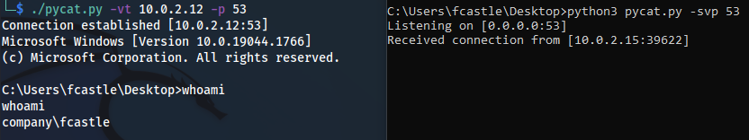

# PyCat

Although a lot of alternatives exist (such as [this python3 implementation](https://pypi.org/project/netcat/) of `netcat`), here's my version of a `netcat` clone in form of a small python3 script. It may not have all the features or handle every edge case - but it gets done what I needed it to do.

In case you face a box that has no `netcat` but `python3` installed you could use this tool for easy file transfer and easy bind shells.

# Download

```
wget https://raw.githubusercontent.com/Cr4ckC4t/pycat/main/pycat.py
```

# Example

1. Start a bind shell on port 53 (right side)
2. Connect to the target on port 53 (left side)



`pycat` is also compatible with `netcat`s bind shell as either server or client:


# Usage

```
python3 pycat.py
```

```
  -h, --help            show this help message and exit
  -t IP, --target IP    target/bind address (default: 0.0.0.0)
  -p PORT, --port PORT  port to use (default:4433)
  -l, --listen          start a listener
  -s, --shell           start an interactive bind shell
  -v, --verbose         show some connection information

Examples:
	(Binary) File Transfer
		./pycat.py -l > out.dat          # Set up a listener
		./pycat.py -t [target] < in.dat  # Send the file

	Bind Shell
		./pycat.py -s           # Set up a bind shell
		./pycat.py -t [target]  # Connect to the target 

	Options
		Use -p to specify the target/bind port.
		Use -t to specify the target/bind address.
		Use -v to add some verbosity.
``` 
